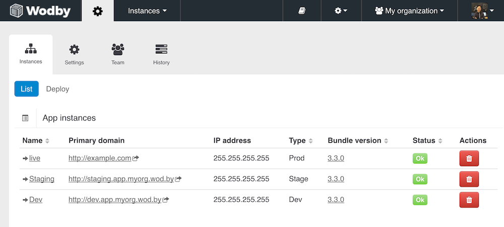

# Application instance



Application instance is a single environment (bundle) deployed for your app (dev, staging, prod, feature, etc). Every app can have unlimited instances but at least one. By default we deploy development (or just dev) instance of your application. But you can deploy as many instances as you want. 

You can remove or add a new instance from the `Instances` page. To get there navigate to the instance page and click on a cogwheel in the header.
 
## Instance type

There are four types of instances: local, dev, staging and production. The local instance can be deployed only to [Vagrant](../servers/connect/vagrant.md), it's also unique per user and not visible to other members of the organization.

There's almost no difference between instance types except error reporting level – all errors are displayed on dev instances and none on staging and production. 

## Deletion

When you delete an instance Wodby does not delete containers' persistent files (database, codebase, etc) on your server to ensure no valuable data will be lost. Please follow the instructions below to clean up your server from these outdated files:
 
1. Move outdated files to a separate directory:
```bash
$ docker run --rm -it -v /srv/wodby:/srv/wodby wodby/cleanup 'API Token'
```

2. Make sure your applications still operate correctly. Delete outdated files:
```bash
$ rm -rf /srv/wodby/_deleted
```