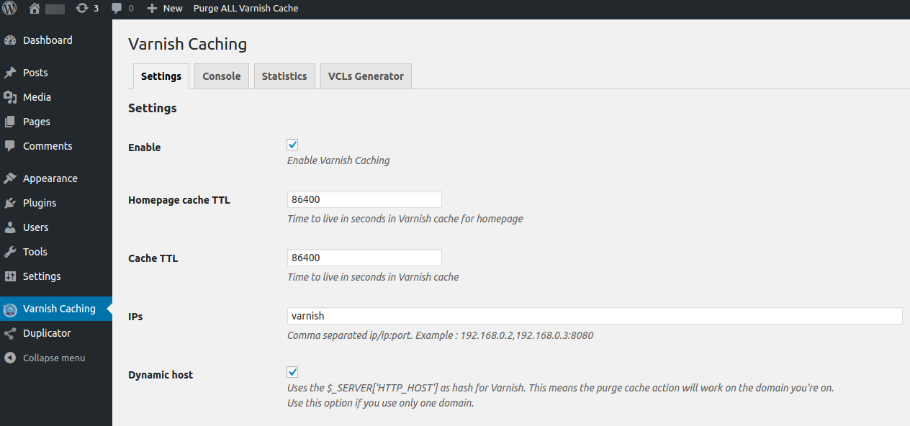

# Varnish

Official website: <a href="https://www.varnish-cache.org/" target="_blank">https://www.varnish-cache.org/</a>

> Service: Reverse caching proxy

* [Access](#access)
* [Version](#version)    
* [Integration with Drupal](#integration-with-drupal)
* [Integration with WordPress](#integration-with-wordpress)
* [Caching rules](#caching-rules)
* [Headers](#headers)
* [CLI](#cli)

## Access

This container doesn't provide SSH access, if you want to access the container please refer [to this article](access.md) (with no SSH).

## Version

The current version of Varnish can be found on `[Instance] > Bundle > Reverse caching proxy` page

## Integration with Drupal

### Drupal 7

1. Install and enable <a href="https://www.drupal.org/project/varnish" target="_blank">varnish module</a> (use the dev version)
2. Enable Varnish integration from `App page > Cache > Cache settings`
3. Go to `Home » Administration » Configuration » Development` page of Drupal website and
    * Check *Cache pages for anonymous users*
    * Check *Compress cached pages.*
    * Check *Aggregate and compress CSS files.*
    * Check *Aggregate JavaScript files.*    
4. Also, we recommend to install <a href="https://www.drupal.org/project/expire" target="_blank">expire module</a> to configure auto purge of pages when some content has been updated. After installation go to `Home » Administration » Configuration » System` and select *External expiration* at the "Module status" tab.

### Drupal 8

1. Install and enable <a href="https://www.drupal.org/project/varnish" target="_blank">varnish module</a>
2. Enable Varnish integration from `App page > Cache > Cache settings`
3. Go to `Home » Administration » Configuration » Development` page of Drupal website and enter the following settings (copy from `[Instance] > Bundle > Reverse caching proxy` page of Wodby Dashboard): 
    * Varnish version = 4.x
    * Varnish Control Terminal = varnish:6082
    * Varnish Control Key = <Copy Secret >
    
## Integration with WordPress

1. Install and activate <a href="https://wordpress.org/plugins/vcaching/" target="_blank">Varnish Caching plugin</a>
2. Enable Varnish Caching as shown below:



## Caching rules

Varnish (for Drupal only) ignores the following GET parameters for cache id generation: 

```
utm_source
utm_medium
utm_campaign
utm_content
gclid
cx
ie
cof
siteurl
```

Set header `Cache-Control:no-cache` to tell Varnish to not cache this page.

## Headers

* `X-Varnish-Cache`: HIT or MISS, corresponds to when the cache was found or not 
* `Age: 34`: age of the cache in seconds
* `X-Varnish: 65658 65623` - the first number is the ID of a request, the second is the ID of cache inside of Varnish. When operating normally the first number changes with every request of the same page and the second stays the same.

## CLI

Grouped list with the most usual entries from different logs:
```bash
$ varnishtop
```

A histogram that shows the time taken for the requests processing:
```bash
$ varnishhist
```

Varnish stats, shows how many contents on cache hits, resource consumption, etc..:
```bash
$ varnishstat
``` 

Log showing requests made to the web backend server:
```bash
$ varnishlog
``` 