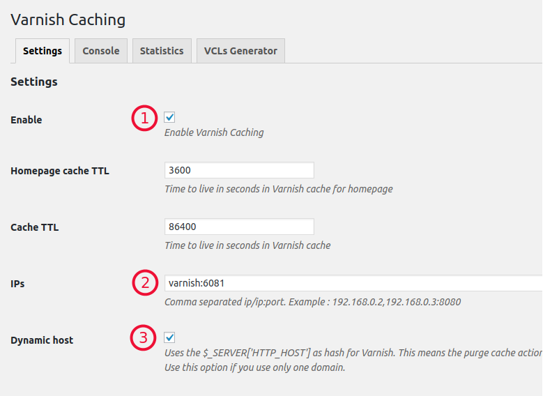

# WordPress stack containers

## Apache

{!stacks/_includes/containers/php-apache.md!}

## AthenaPDF

See [AthenaPDF stack documentation](../athenapdf/index.md).

## Blackfire

{!stacks/_includes/containers/blackfire.md!}

## Crond

{!stacks/_includes/containers/php-crond.md!}

## Mailhog

{!stacks/_includes/containers/mailhog.md!}

## MariaDB

See [MariaDB stack documentation](../mariadb/index.md).

## Memcached

{!stacks/_includes/containers/memcached.md!}

## Nginx

!!! important "New Nginx image" 
    Since WordPress stacks 5.2.0+ nginx image `wodby/wordpress-nginx` has been replaced with [`wodby/nginx`](https://github.com/wodby/nginx) with `$NGINX_VHOST_PRESET=wordpress`
    
{!stacks/_includes/containers/nginx.md!}

Default virtual host preset: [`wordpress`](https://github.com/wodby/nginx/blob/master/templates/presets/wordpress.conf.tmpl)    

!!! warning "Do not gzip pages in WordPress"
    We already gzip content on Nginx side and it works faster. Having double gzip may cause issues.

### Custom config

If the default config and available environment variables are not enough for your customizations you can replace the config with your own:

1. Copy `/etc/nginx/conf.d/php.conf` to your codebase, adjust to your needs
2. Deploy code with your config file
3. Add new environment variable `NGINX_CONF_INCLUDE` for nginx service, the value should the path to your *.conf file (e.g. `/var/www/html/nginx.conf`)

### Custom config

If the default wordpress config and available environment variables are not enough for your customizations you can replace the config with your own:

1. Copy `/etc/nginx/conf.d/wordpress.conf` to your codebase, adjust to your needs
2. Deploy code with your config file
3. Add new environment variable `NGINX_CONF_INCLUDE` for nginx service, the value should the path to your *.conf file (e.g. `/var/www/html/nginx.conf`

### Mod pagespeed

Nginx comes with [mod_pagespeed](https://www.modpagespeed.com/) which is disabled by default. To enable it add `NGINX_PAGESPEED=on` environment variable to Nginx service.

## Node.js

{!stacks/_includes/containers/node.md!}

## OpenSMTPD

See [OpenSMTPD stack documentation](../opensmtpd/index.md).

## PHP

{!stacks/_includes/containers/php.md!}
{!stacks/_includes/containers/php-dev.md!}

### WP CLI

PHP container comes with pre-installed WP CLI.

### Redirects

If you need to make a redirect from one domain to another you can do it by customizing configuration files of nginx or by adding the snippets below to your `wp-config.php` file.

Redirect from one domain to another:

```php
if (isset($_SERVER['WODBY_ENVIRONMENT_TYPE']) && $_SERVER['WODBY_ENVIRONMENT_TYPE'] == 'prod' && php_sapi_name() != "cli") {
    if ($_SERVER['HTTP_HOST'] == 'redirect-from-domain.com') {
      header('HTTP/1.0 301 Moved Permanently');
      header('Location: http://redirect-to-domain.com' . $_SERVER['REQUEST_URI']);
      exit();
    }
}
```

Redirect from multiple domains:

```php
if (isset($_SERVER['WODBY_ENVIRONMENT_TYPE']) && $_SERVER['WODBY_ENVIRONMENT_TYPE'] == 'prod' && php_sapi_name() != "cli") {
    $redirect_from = array(
      'redirect-from-domain-1.com',
      'redirect-from-domain-2.com',
    );

    if (in_array($_SERVER['HTTP_HOST'], $redirect_from)) {
      header('HTTP/1.0 301 Moved Permanently');
      header('Location: http://redirect-to-domain.com' . $_SERVER['REQUEST_URI']);
      exit();
    }
}
```

## PostgreSQL

See [PostgreSQL stack documentation](../postgres/index.md).

## Redis

You can configure Redis via environment variables that listed at https://github.com/wodby/redis. See [Redis stack](../redis/index.md) for more details.

Integration:

1. Install and activate [redis plugin](https://wordpress.org/plugins/redis-cache)
2. Go to redis plugin settings page and click "enable object cache" button

## Rsyslog

{!stacks/_includes/containers/php-rsyslog.md!}

## SSHd

{!stacks/_includes/containers/php-sshd.md!}

## Varnish 

!!! important "New Varnish image"
    Since WordPress stacks 5.2.0+ Varnish image `wodby/wordpress-varnish` has been replaced with [`wodby/varnish`](https://github.com/wodby/varnish) and `$VARNISH_CONFIG_PRESET=wordpress`

Integration:

1. Go to `App instance > Stack > Varnish` in Wodby dashboard and copy automatically generated value of `$VARNISH_PURGE_KEY`
2. Install and activate [Varnish Caching plugin](https://wordpress.org/plugins/vcaching) in your WordPress website
3. On the plugin cache settings configure as shown below:  
    
4. Copy/paste the key to `Purge key` in plugin setting 
5. Save all plugin settings changes

For more details see [Varnish stack documentation](../varnish/index.md)

## Webgrind

{!stacks/_includes/containers/webgrind.md!}
