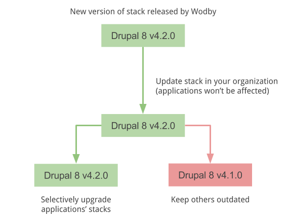

# Stack Versioning and Upgrade

We regularly update stacks by releasing new versions, such updates can include security updates and performance improvements. You can find more details under the Changelog tab on a stack page.

The stack has a requirement for the minimal [version of infrastructure](../infrastructure/versioning.md) of the server where this stack is deployed. You can find a stack's version of your application on the list of your apps or under `Stack` tab of your [instance](../apps/instances.md). If a stack is outdated you will see an appropriate indicator.

## Updating Stack in Organization

When a new version of a stack has been released  your stack will be marked as outdated. You can update a stack to the latest version from a stack page in your organization. This update **will not affect** your applications, it only updates the version of a stack inside of your organization.

## Upgrading Application Stack

Once you update a stack in your organization, you can upgrade the application instances. Go the `Instance > Stack > Operations` page and click Upgrade. The downtime depends on the number of services affected in a new version and what <a href="template.html#deployment">deployment strategy</a> used in these services. 
